# Architecture Diagram

Visual representation of the NestJS Monorepo Template architecture.

## 🏗️ Complete Architecture

```mermaid
flowchart TB
    subgraph Root["📦 nestjs-monorepo-template/"]
        direction TB
        
        subgraph Apps["📱 apps/ (Independent Services)"]
            direction TB
            API["api-server<br/>📍 Port 3001<br/>REST API • Validation • Health"]
            Worker["worker<br/>⚙️ Background Service<br/>Scheduled Tasks • No HTTP"]
            WS["websocket-service<br/>📍 Port 3002<br/>Real-time • Socket.IO"]
            Admin["admin<br/>📍 Port 3003<br/>Admin Panel • Management"]
        end
        
        subgraph Libs["📚 libs/ (Shared Reusable Code)"]
            direction TB
            DB["db/<br/>🗄️ Database Abstraction<br/>MongoDB ↔ PostgreSQL ↔ MySQL"]
            Config["configuration/<br/>⚙️ Environment Config<br/>Type-safe • Validation"]
            Common["common/<br/>🛠️ Utilities<br/>Logging • Errors • Filters"]
        end
        
        RootFiles["📄 Root Files<br/>package.json • tsconfig.json<br/>nest-cli.json • .env"]
    end

    %% Dependencies - All apps use all libs
    API -->|imports| DB
    API -->|imports| Config
    API -->|imports| Common
    
    Worker -->|imports| DB
    Worker -->|imports| Config
    Worker -->|imports| Common
    
    WS -->|imports| DB
    WS -->|imports| Config
    WS -->|imports| Common
    
    Admin -->|imports| DB
    Admin -->|imports| Config
    Admin -->|imports| Common

    %% Styling
    classDef app fill:#e3f2fd,stroke:#1976d2,stroke-width:3px,color:#000,font-weight:bold
    classDef lib fill:#f3e5f5,stroke:#7b1fa2,stroke-width:3px,color:#000,font-weight:bold
    classDef root fill:#fff3e0,stroke:#f57c00,stroke-width:2px,color:#000
    
    class API,Worker,WS,Admin app
    class DB,Config,Common lib
    class RootFiles root
```

## 🔄 Data Flow

```mermaid
flowchart LR
    subgraph Client["👤 Client"]
        Browser["Browser"]
        Mobile["Mobile App"]
        AdminUI["Admin UI"]
    end
    
    subgraph Services["🚀 Services"]
        API["api-server<br/>:3001"]
        WS["websocket-service<br/>:3002"]
        Admin["admin<br/>:3003"]
    end
    
    subgraph Worker["⚙️ Background"]
        WorkerService["worker<br/>(No Port)"]
    end
    
    subgraph Database["💾 Database"]
        MongoDB["MongoDB"]
        PostgreSQL["PostgreSQL"]
        MySQL["MySQL"]
    end
    
    Browser -->|HTTP/REST| API
    Mobile -->|HTTP/REST| API
    Browser -->|WebSocket| WS
    AdminUI -->|HTTP/REST| Admin
    
    API -->|Read/Write| Database
    WS -->|Read/Write| Database
    Admin -->|Read/Write| Database
    WorkerService -->|Read/Write| Database
    
    API -.->|Events| WS
    WorkerService -.->|Process| API
```

## 📦 Dependency Graph

## 🗄️ Database Abstraction Layer

## 🚀 Deployment Architecture

## 📊 Port Configuration

## 🔧 Configuration Flow

## 📝 How to View These Diagrams

1. **GitHub**: These diagrams will render automatically in GitHub markdown
2. **VS Code**: Install "Markdown Preview Mermaid Support" extension
3. **Online**: Copy the mermaid code to [mermaid.live](https://mermaid.live)
4. **Documentation**: Use in your documentation site (Docusaurus, GitBook, etc.)

## 🎨 Diagram Legend

- **Blue boxes**: Applications (apps/)
- **Purple boxes**: Shared libraries (libs/)
- **Orange boxes**: Configuration/Root files
- **Green boxes**: Infrastructure/Deployment
- **Arrows**: Dependencies/Data flow

## 📚 Related Documentation

- [ARCHITECTURE.md](./ARCHITECTURE.md) - Detailed architecture explanation
- [README.md](./README.md) - Main documentation
- [PORT_CONFIGURATION.md](./PORT_CONFIGURATION.md) - Port setup guide

